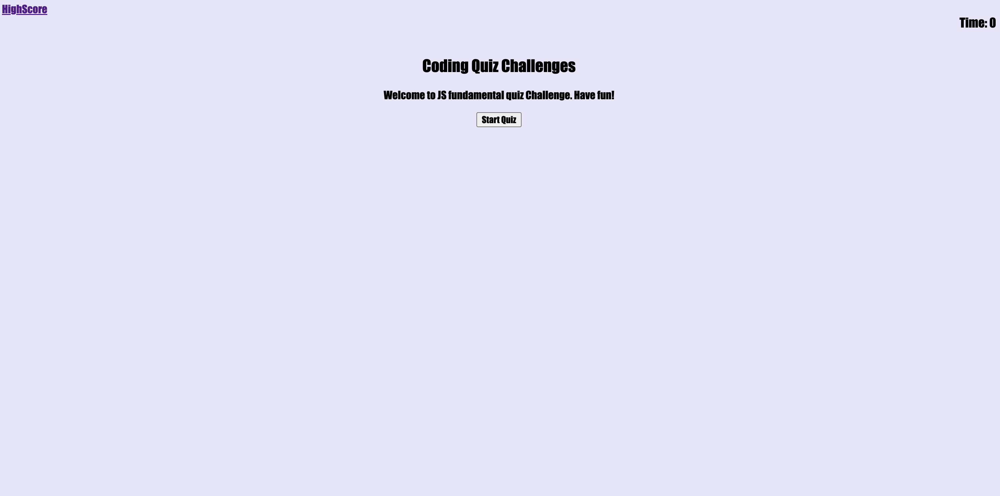

# JavaScript_Code_Quiz
In this Homework we had to created a quiz about JavaScript from scrachm, first you needed a start button to start the quiz then we also needed a timer that counts down, once you clicked the button you were presented with the first question and then after answering the question, then your presented with another question, if wrong answer click then a wrong text will apperd and 10s will be decreased from the timer and if timer reaches 0 then the game is over, when the game the is over the it will ask you to save your initials and score.

